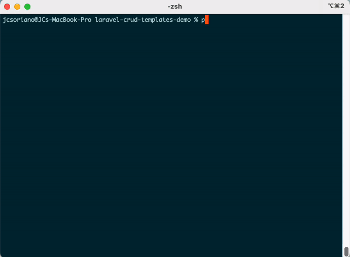

# Laravel CRUD Templates

[](https://packagist.org/packages/jcsoriano/laravel-crud-templates)
[](https://github.com/jcsoriano/laravel-crud-templates/actions?query=workflow%3Arun-tests+branch%3Amain)
[](https://github.com/jcsoriano/laravel-crud-templates/actions?query=workflow%3A"Fix+PHP+code+style+issues"+branch%3Amain)
[](https://packagist.org/packages/jcsoriano/laravel-crud-templates)

CRUD Templates for Laravel allows you to generate controllers, models, policies, requests, resources, migrations, factories, and even tests - all the files you need to complete CRUD features with a single command. You can completely modify the template or create your own templates to fit your project's conventions perfectly.



## FAQs

1. **Why do I need this if AI can generate the files for me?** AI is nondeterministic. Sometimes, it won't follow your conventions perfectly, sometimes it may miss things. This generates all of the files for you programmatically - it will be complete and exact, and a great base for further work with your AI.
2. **What if the generated files don't fit my project's conventions?** Everything is customizable. You can modify the stubs, add more file types to generate, or even create your own CRUD templates - create multiple for different scenarios!
3. **Won't this take over my job?** This will take over the _grunt_ work of your job - generating the first 80% of the code that you probably don't like doing anyway, and leaving you to focus on the unique logic that makes your project special - the last 20%. 

## Requirements

- PHP 8.4 or higher
- Laravel 11.0 or 12.0

## Installation

You can install the package via Composer as a dev dependency:

```bash
composer require --dev jcsoriano/laravel-crud-templates
```

The package will automatically register itself via Laravel's package discovery.

### Publishing Stubs (Optional)

You can publish the stubs to customize them:

```bash
php artisan vendor:publish --tag="laravel-crud-templates-stubs"
```

## The Command

To generate a CRUD feature, you may use this command:

```
php artisan crud:generate
  {model : The name of the model}
  {--fields= : The fields to generate. Format: field1:type1,field2?:type2}
  {--table= : The database table to generate the fields from}
  {--template=api : The CRUD template to generate}
  {--skip= : List of files you want to skip}
  {--options= : Other options to pass to the generator. Format: key1:value1,key2:value2}
  {--force : Overwrite existing files}
```

## Quick Start Example

Sample command to generate a fully functioning RESTful API:

```
php artisan crud:generate Content/Post --template=api --fields="title:string,content:text,published_at:datetime,category:belongsTo,comments:hasMany,status:enum:PublishStatus" --options="scope:user"
```

### Generated Files

This command generates all the files needed to complete the CRUD feature, from routes, to validation, to authorization, to API responses, to migrations, to factories, to tests, and more.

- `app/Http/Controllers/Api/Content/PostController.php` - RESTful API controller
- `app/Models/Content/Post.php` - Eloquent model with fillable fields and casts, a belongsTo relation with the Category model, and a hasMany relation with the Comment model.
- `app/Policies/PostPolicy.php` - Authorization policy, scoped to the authenticated user.
- `app/Http/Requests/Content/StorePostRequest.php` - Validation for create operations
- `app/Http/Requests/Content/UpdatePostRequest.php` - Validation for update operations
- `app/Http/Resources/Content/PostResource.php` - API resource for transforming responses
- `database/migrations/{timestamp}_create_posts_table.php` - Database migration
- `database/factories/Content/PostFactory.php` - Model factory for testing
- `tests/Feature/Api/Content/PostControllerTest.php` - Feature tests
- API routes automatically added
- All generated files formatted using Pint

### Generated Routes

The command automatically registers the following routes in your `routes/api.php` file:

| HTTP Method | URI | Action | Description |
|-------------|-----|--------|-------------|
| GET | `/api/posts` | `index` | List all posts (paginated) |
| POST | `/api/posts` | `store` | Create a new post |
| GET | `/api/posts/{id}` | `show` | Show a specific post |
| PUT/PATCH | `/api/posts/{id}` | `update` | Update a post |
| DELETE | `/api/posts/{id}` | `destroy` | Delete a post |

### Response Format

#### Single Resource:
```json
{
  "data": {
    "id": 1,
    "title": "My Post",
    "content": "...",
    "category": { "...": "..." },
    "comments": [ { "...": "..." } ],
    "status": "published",
    "published_at": "2024-01-01T00:00:00.000000Z",
    "created_at": "2024-01-01T00:00:00.000000Z",
    "updated_at": "2024-01-01T00:00:00.000000Z"
  }
}
```

#### Collection (with pagination):
```json
{
  "data": [
    { "The Post object as above" },
  ],
  "links": { "first": "...", "last": "...", "prev": null, "next": "..." },
  "meta": { "current_page": 1, "per_page": 15, "total": 50 }
}
```

### Validation Rules

The request classes automatically include appropriate validation:

**StorePostRequest:**
```php
public function rules(): array
{
    return [
        'title' => ['required', 'string', 'max:255'],
        'content' => ['required', 'string'],
        'published_at' => ['required', 'date'],
        'category_id' => ['bail', 'required', 'exists:categories,id'],
        'status' => ['required', Rule::enum(PublishStatus::class)],
    ];
}
```

### Model Enhancements

The generated `Post` model will include several automatic enhancements:

#### Relationship Methods:
```php
public function category(): BelongsTo
{
    return $this->belongsTo(Category::class);
}

public function comments(): HasMany
{
    return $this->hasMany(Comment::class);
}
```

#### Type Casting:
```php
protected $casts = [
    'published_at' => 'immutable_datetime',  // Automatic datetime casting
    'status' => PublishStatus::class,        // Enum casting
];
```

#### Fillable Fields:
```php
protected $fillable = [
    'title',
    'content',
    'published_at',
    'category_id',
    'status',
];
```

### Migration with Foreign Keys

The migration includes proper foreign key constraints:

```php
Schema::create('posts', function (Blueprint $table) {
    $table->id();
    $table->string('title');
    $table->text('content');
    $table->dateTime('published_at');
    $table->foreignId('category_id')->constrained();
    $table->string('status');
    $table->timestamps();
});
```

### API Resource

The generated `PostResource` automatically includes relationships:

```php
public function toArray($request): array
{
    return [
        ...
        'category' => new CategoryResource($this->whenLoaded('category')),
        'comments' => CommentResource::collection($this->whenLoaded('comments')),
    ];
}
```

## Documentation

📚 **[View Full Documentation](https://laravelcrudtemplates.com)**

### Getting Started
- [Installation](https://laravelcrudtemplates.com/guide/installation) - Requirements and installation guide
- [Quick Start](https://laravelcrudtemplates.com/guide/quick-start) - Generate your first CRUD in minutes

### Using Templates
- [Field Types](https://laravelcrudtemplates.com/guide/field-types) - Complete list of supported field types
- [Relationships](https://laravelcrudtemplates.com/guide/relationships) - Working with model relationships
- [Generate from Schema](https://laravelcrudtemplates.com/guide/generate-from-schema) - Generate from existing database tables

### Available Templates
- [API Template](https://laravelcrudtemplates.com/templates/api) - RESTful API CRUD generation
- [Creating Your Own Template](https://laravelcrudtemplates.com/templates/custom) - Create templates for your own use cases

### Customizing Templates
- [Customizing Stubs](https://laravelcrudtemplates.com/templates/customizing-stubs) - Modify stub templates
- [Customizing Field Types](https://laravelcrudtemplates.com/templates/customizing-field-types) - Extend with custom field types
- [Customizing Generators](https://laravelcrudtemplates.com/templates/customizing-generators) - Override file generators
- [Customizing Printers](https://laravelcrudtemplates.com/templates/customizing-printers) - Customize code output

## Coming Soon

1. **Filament CRUD Generator** - a Filament GUI for generating CRUD features
2. **Livewire CRUD Generator** - a CRUD template built for the Livewire starter kit
3. **Vue CRUD Generator** - a CRUD template built for the Vue starter kit
4. **React CRUD Generator** - a CRUD template built for the React starter kit

## Changelog

Please see [CHANGELOG](CHANGELOG.md) for more information on what has changed recently.

## Contributing

Please see [CONTRIBUTING](CONTRIBUTING.md) for details.

## Security Vulnerabilities

Please review [our security policy](../../security/policy) on how to report security vulnerabilities.

## Credits

- [JC Soriano](https://github.com/jcsoriano)
- [All Contributors](../../contributors)

## License

The MIT License (MIT). Please see [License File](LICENSE.md) for more information.